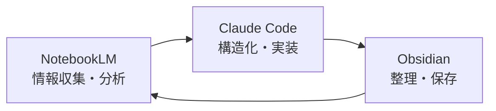
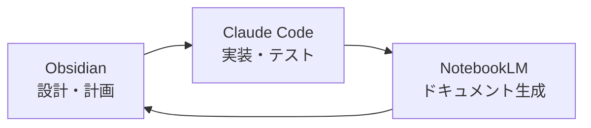

# 🔗 Obsidian × NotebookLM × Claude Code 統合システム

## 📊 基本情報
- **プロジェクト名**: 3ツール統合知識管理システム
- **目的**: 知識の収集・整理・分析・実装の完全自動化
- **作成日**: 2025-07-02
- **状態**: 🚧 構築中

## 🎯 統合の目的
1. **Obsidian**: 知識の整理・体系化・視覚化
2. **NotebookLM**: AIによる深い分析・要約・洞察
3. **Claude Code**: 実装・自動化・システム構築

## 🔄 ワークフロー設計

### 1️⃣ 研究・学習フロー


### 2️⃣ 実装・開発フロー


## 📁 統合フォルダ構造
```
C:\Desktop\Obsidian\study\
├── 📚 NotebookLM連携/
│   ├── インポート待ち/     # NotebookLMへアップロード予定
│   ├── 分析結果/           # NotebookLMからの出力
│   └── 質問リスト/         # NotebookLMへの質問集
├── 🤖 Claude連携/
│   ├── 実装タスク/         # Claude Codeで実装予定
│   ├── 生成コード/         # Claude Codeが生成したコード
│   └── セッション記録/     # Claude Codeとのやり取り
└── 🔄 統合出力/
    ├── 日次サマリー/       # 3ツールの統合レポート
    └── プロジェクト成果/   # 完成したプロジェクト

```

## 🛠️ 連携機能

### 📤 Obsidian → NotebookLM
- **マークダウンエクスポート**: 研究ノートをPDF/テキスト化
- **質問生成**: NotebookLMで深掘りしたい質問を自動生成
- **タグベース選択**: 特定タグのノートを一括エクスポート

### 📥 NotebookLM → Obsidian
- **要約インポート**: NotebookLMの分析結果を自動整形
- **引用管理**: ソース情報を含めて保存
- **関連リンク生成**: 既存ノートとの関連付け

### 🔧 Claude Code ↔ Obsidian
- **タスク同期**: ObsidianのTODOをClaude Codeで実行
- **コード保存**: 生成されたコードを適切な場所に保存
- **実行ログ**: セッション記録を自動保存

## 💡 活用シナリオ

### 📚 研究論文の理解と実装
1. **NotebookLM**: 論文PDF群をアップロード → 要約・関連性分析
2. **Obsidian**: 分析結果を体系的に整理 → 実装計画作成
3. **Claude Code**: アルゴリズム実装 → テスト・最適化
4. **統合**: 実装結果をドキュメント化 → NotebookLMで解説生成

### 🎓 新技術の学習
1. **Obsidian**: 学習計画・質問リスト作成
2. **NotebookLM**: 関連資料分析 → 理解の深化
3. **Claude Code**: サンプルコード作成・実験
4. **循環**: 実験結果を基に新たな質問生成

### 💼 プロジェクト管理
1. **Obsidian**: プロジェクト計画・タスク管理
2. **Claude Code**: 自動化スクリプト・ツール開発
3. **NotebookLM**: 進捗レポート・ドキュメント生成
4. **統合**: 全体の知識ベース構築

## 🔧 技術的実装

### 自動化スクリプト
- `obsidian_to_notebooklm.py`: Obsidianノートのエクスポート
- `notebooklm_to_obsidian.py`: NotebookLM結果のインポート
- `claude_session_sync.py`: Claude Codeセッション同期
- `daily_integration_report.py`: 日次統合レポート生成

### API/連携方法
- **Obsidian**: ローカルファイルシステム経由
- **NotebookLM**: 手動アップロード/ダウンロード（自動化検討中）
- **Claude Code**: セッション記録の自動保存機能活用

## 📋 実装タスク
- [ ] エクスポート/インポート基本機能
- [ ] 自動タグ付けシステム
- [ ] 質問自動生成機能
- [ ] セッション記録パーサー
- [ ] 統合ダッシュボード作成
- [ ] ワンクリック連携ツール

## 🏷️ タグ
#プロジェクト #統合 #obsidian #notebooklm #claude-code #自動化

---
Back: [[学習マップ]]